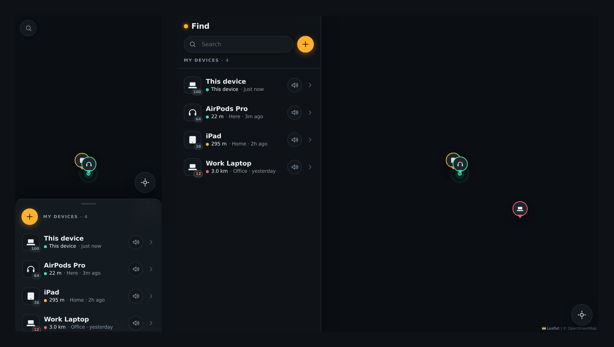

# Find — a sleek device locator

**Find** is a small, fast, installable web app for locating all your devices on
one map. It's built to be glanceable and touch-first: open it and everything you
own is already on a dark live map with a distance, last-seen and battery on every
row. It works the same on a phone and a tablet.



## Design goals

The whole app was shaped around four rules:

1. **Sleek and simple** — one dark "instrument" screen, no tabs, no chrome you
   don't need. A single sodium-amber accent, mint/amber/coral only where they
   carry meaning (freshness, battery, lost).
2. **Minimum taps for any task** — the common questions are answered at **0 taps**
   (distance, place, last-seen and battery are already on the row). Everything
   else is one or two:

   | Task | Taps |
   | --- | --- |
   | See where a device is | **1** (tap row or pin → map flies there) |
   | Ring / play a sound | **1** (speaker button on the row) |
   | Register a new device | **2** (`+` → *Add here*) |
   | Get directions | **2** (select → *Directions*) |
   | Re-centre on yourself | **1** (locate button) |

3. **Effortless registration** — tap `+`, the name field is already focused with
   the keyboard up, the device type is auto-guessed from what you type, and your
   current location is pre-filled. Tap **Add here** and it's on the map. Typing a
   name is optional.
4. **Phone and tablet, seamlessly** — one layout, two postures. On phones the
   device list is a draggable glass bottom-sheet over the map; on tablets it
   becomes a fixed side-rail with an inline detail panel beside a persistent map.

## How it works

- **Your current device** registers itself on first launch and reports its **real
  location live** via the browser Geolocation API.
- **Other devices** are records with a last-known location, freshness (live /
  stale / cold), battery and status. A few realistic examples are seeded near you
  on first run so the map isn't empty — forget them anytime.
- Everything is stored locally in `localStorage`; there is **no backend and no
  account**. That keeps it private, instant and offline-capable — but it also
  means rings only sound on the device you're holding (the UI says so honestly),
  and devices don't sync between gadgets on their own. See *Going multi-device*.

## Tech

- **Vite + React 19 + TypeScript**
- **Leaflet** with OpenStreetMap tiles, restyled dark via a CSS filter (tiles are
  cached by the service worker for offline use)
- **Installable PWA** (`vite-plugin-pwa`) — add it to your home screen and it runs
  full-screen with safe-area insets
- No UI framework; a small CSS design-token system in `src/styles/tokens.css`

## Run it

```bash
npm install
npm run dev        # http://localhost:5173
```

Open it on your phone (same network, or deploy it) and **allow location** to see
yourself on the map. Then `+` → *Add here* to register a device.

```bash
npm run build      # type-check + production build into dist/
npm run preview    # serve the production build
npm run lint       # oxlint
```

> Location requires a secure context. `localhost` and any `https://` host work;
> plain-HTTP LAN IPs will not grant geolocation.

## Deploy (GitHub Pages)

This repo ships a workflow (`.github/workflows/deploy.yml`) that builds the PWA
and publishes it to a `gh-pages` branch on every push. Production builds use a
`/find/` base path (the repo name); override it with the `BASE_PATH` env var for
a custom domain or a user/organisation site.

One-time setup, then it's automatic:

1. Push the branch — the **Deploy to GitHub Pages** action builds and creates the
   `gh-pages` branch.
2. In the repo, go to **Settings → Pages → Build and deployment**, set
   **Source = Deploy from a branch**, choose **`gh-pages` / `root`**, and save.
3. Open `https://<your-user>.github.io/find/` on any phone or tablet and
   **Add to Home Screen** to install it. (HTTPS satisfies the geolocation
   secure-context requirement, so the live map works.)

## Project layout

```
src/
  App.tsx                 app shell: state, handlers, phone/tablet composition
  types.ts                Device / GeoFix / PersistedState
  store/devices.ts        external store + localStorage + example seeding
  lib/
    geo.ts                haversine, distance/time formatting, freshness, type-guess
    geolocation.ts        watch / one-shot / permission / battery wrappers
    select.ts             decorate devices with distance + freshness, sort
    sound.ts              Web Audio "find me" chime
  hooks/                  useStore, useNow, useMediaQuery, useSelfTracking
  components/             DeviceMap, DeviceRow, BottomSheet, SideRail, Modal,
                          ActionSheet, AddSheet, SearchPill, LocateFab, Toast, Icons
  styles/tokens.css       palette, type scale, spacing, radii, motion
```

## Going multi-device (future)

The data model and store are intentionally backend-agnostic. To make devices
actually report to each other you'd add a small sync service: each device PUTs its
own `GeoFix` periodically and the app reads the shared set, replacing the
`localStorage` read/write in `src/store/devices.ts`. Remote ring would become a
push to the target device. Nothing else in the UI needs to change.
